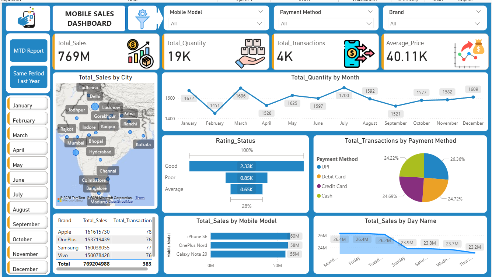

📊 Mobile Sales Dashboard (Power BI)
📌 Overview

This project is an interactive Mobile Sales Dashboard built using Microsoft Power BI. It analyzes mobile phone sales data and provides insights into sales performance, customer behavior, and product trends.

🎯 Key Features

Total Sales, Quantity, Transactions, and Average Price

Sales distribution by city

Monthly sales trend

Payment method analysis (UPI, Debit Card, Credit Card, Cash)

Top mobile models and brand performance

Month-to-Date (MTD) sales analysis

Same Period Last Year (YoY) comparison

🛠 Tools Used

Power BI

Excel Dataset

DAX

Power Query

📷 Dashboard Preview

  

📥 Download Project

Google Drive Link:
👉 https://drive.google.com/drive/folders/1bYjfCcHvF7Er_Fe4iCVp4il5w4vL4Exw?usp=drive_link

👨‍💻 Author

Nayan Samanta
